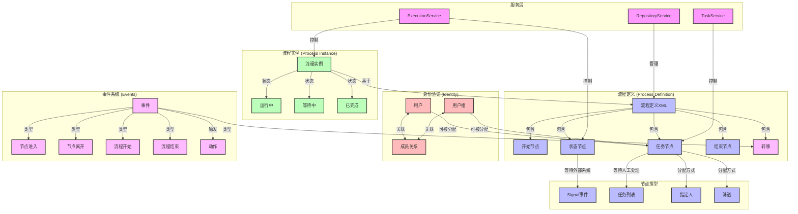

```mermaid
graph TB
    subgraph "流程定义 (Process Definition)"
        PD[流程定义XML]
        PD --> |包含| Start[开始节点]
        PD --> |包含| State[状态节点]
        PD --> |包含| Task[任务节点]
        PD --> |包含| End[结束节点]
        PD --> |包含| Transition[转移]
    end

    subgraph "流程实例 (Process Instance)"
        PI[流程实例]
        PI --> |基于| PD
        PI --> |状态| Running[运行中]
        PI --> |状态| Waiting[等待中]
        PI --> |状态| Completed[已完成]
    end

    subgraph "节点类型"
        State --> |等待外部系统| Signal[Signal事件]
        Task --> |等待人工处理| TaskList[任务列表]
        Task --> |分配方式| Assignee[指定人]
        Task --> |分配方式| Swimlane[泳道]
    end

    subgraph "身份验证 (Identity)"
        User[用户]
        Group[用户组]
        Membership[成员关系]
        User <--> |关联| Membership
        Group <--> |关联| Membership
        User --> |可被分配| Task
        Group --> |可被分配| Task
    end

    subgraph "事件系统 (Events)"
        Event[事件]
        Event --> |类型| NodeEnter[节点进入]
        Event --> |类型| NodeLeave[节点离开]
        Event --> |类型| Transition[转移]
        Event --> |类型| ProcessStart[流程开始]
        Event --> |类型| ProcessEnd[流程结束]
        Event --> |触发| Action[动作]
    end

    subgraph "服务层"
        RS[RepositoryService]
        ES[ExecutionService]
        TS[TaskService]
        RS --> |管理| PD
        ES --> |控制| PI
        ES --> |控制| State
        TS --> |控制| Task
    end

    classDef service fill:#f9f,stroke:#333,stroke-width:2px
    classDef node fill:#bbf,stroke:#333,stroke-width:2px
    classDef instance fill:#bfb,stroke:#333,stroke-width:2px
    classDef identity fill:#fbb,stroke:#333,stroke-width:2px
    classDef event fill:#fbf,stroke:#333,stroke-width:2px

    class RS,ES,TS service
    class Start,State,Task,End node
    class PI,Running,Waiting,Completed instance
    class User,Group,Membership identity
    class Event,NodeEnter,NodeLeave,Transition,ProcessStart,ProcessEnd,Action event
``` 